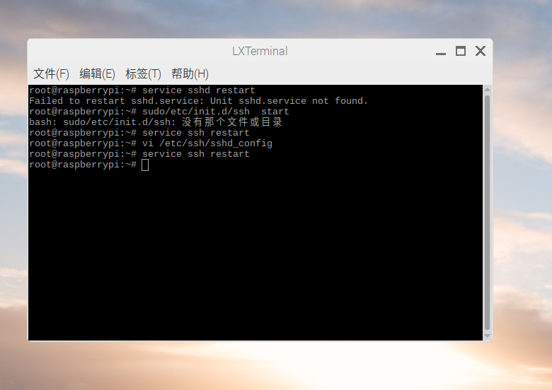

[TOC]


# 树莓派学习笔记


## 1.树莓派是什么？

简单来说，树莓派就是搭载arm处理器，接口丰富（除了电脑常用的一些接口以外，还有gpio接口，可以进行嵌入式开发）的信用卡大小的微型电脑。

据官方说是慈善性质的，是教育目的，为了让更多的小孩能用上电脑。毕竟每一个树莓派，仅售35美元。

相当于可以搭载linux操作系统的开发板，另外主要推荐语言是python，所以叫做raspberry pi，pi指的是python编程语言。

国内通常用于物联网的学习。

## 2.开发环境搭建

本人购买的是RS板的树莓派3B+，而且我的系统镜像选择的是，默认后面的文章都是基于这个版本

### 01.启动树莓派

树莓派的启动必须配件有：

* tf卡
* 开发板
* 电源


tf卡需要事先烧录好系统，插入树莓派，接上电源就会自动启动了。

可以给树莓派接上屏幕，鼠标键盘这些进行操作。

### 02.连接电脑和树莓派

有以下几种方法：

* 使用网线连接电脑，然后ssh连接
* 使用串口转usb连接，需要购买额外的组件


但不管怎么样，第一步要装上系统。

系统装上后接上电源直接就会开机，但是ssh貌似不是默认开启的。还有网络，也需要配置。

所以我采用了一种不接线，也不连接显示器的方法，使用手机热点来配置（因为学校内网络限制 闪讯！）

即，无屏幕和键盘配置树莓派WiFi和SSH

在树莓派3B发布后不久，树莓派官方 Raspbian 系统久加入了允许在开机前对 WiFi 网络进行配置的机制。

#### 一、WiFi 网络配置

用户可以在未启动树莓派的状态下单独修改 `/boot/wpa_supplicant.conf` 文件配置 WiFi 的 SSID 和密码，这样树莓派启动后会自行读取 wpa_supplicant.conf 配置文件连接 WiFi 设备。

操作方法简单：将刷好 Raspbian 系统的 SD 卡用电脑读取。在 boot 分区，也就是树莓派的 `/boot` 目录下新建 wpa_supplicant.conf 文件，按照下面的参考格式填入内容并保存 wpa_supplicant.conf 文件。

```
country=CN
ctrl_interface=DIR=/var/run/wpa_supplicant GROUP=netdev
update_config=1
 
network={
ssid="WiFi-A"
psk="12345678"
key_mgmt=WPA-PSK
priority=1
}
 
network={
ssid="WiFi-B"
psk="12345678"
key_mgmt=WPA-PSK
priority=2
scan_ssid=1
}
```

说明以及不同安全性的 WiFi 配置示例：
#ssid:网络的ssid
#psk:密码
#priority:连接优先级，数字越大优先级越高（不可以是负数）
#scan_ssid:连接隐藏WiFi时需要指定该值为1

如果你的 WiFi 没有密码

```
network={
ssid="你的无线网络名称（ssid）"
key_mgmt=NONE
}

```

如果你的 WiFi 使用WEP加密

```
network={
ssid="你的无线网络名称（ssid）"
key_mgmt=NONE
wep_key0="你的wifi密码"
}
```


如果你的 WiFi 使用WPA/WPA2加密

```
network={
ssid="你的无线网络名称（ssid）"
key_mgmt=WPA-PSK
psk="你的wifi密码"
}
```


如果你不清楚 WiFi 的加密模式，可以在安卓手机上用 root explorer 打开 `/data/misc/wifi/wpa/wpa_supplicant.conf`，查看 WiFi 的信息。

#### 二、开启 SSH 服务

如果通过 ssh 连接树莓派出现 Access denied 这个提示则说明 ssh 服务没有开启。要手动开启的话，和 WiFi 配置相似，同样在 boot 分区新建一个文件，空白的即可，文件命名为 ssh。注意要小写且不要有任何扩展名。
树莓派在启动之后会在检测到这个文件之后自动启用 ssh 服务。随后即可通过登录路由器找到树莓派的 IP 地址，通过 ssh 连接到树莓派了。（[有关开启 SSH 服务的详细方法](http://shumeipai.nxez.com/2017/02/27/raspbian-ssh-connection-refused.html)）

如果需要远程桌面方式操作树莓派，可以通过 ssh 安装 xrdp，[再用 Windows 的远程桌面客户端连接到树莓派](http://shumeipai.nxez.com/2013/10/06/windows-remote-desktop-connection-raspberry-pi.html)。

这个小技巧对于没有有线网卡、没有标准 USB 接口来直连键鼠，但集成了 WiFi 的[树莓派 Zero W](https://item.taobao.com/item.htm?id=557980870076) 尤其实用。


#### 三、连接电脑

此时连接电脑还会碰到问题，

1. 由于是热点连接不能方便地知道树莓派的ip地址。不知道ip地址也就不能通过ssh连接
2. 处于安全性的考虑，root账号的默认ssh权限是关着的。我们需要开启他。

没有路由器，所以我想到了用安卓机当热点构建一个局域网。

我这个安卓机，并不支持查看热点分配的局域网ip，只能看到连接热点设备的mac地址。官方没有实现这个对一般人没什么卵用的功能。

所以这里我使用了一个小软件。可以扫描一个网段

Advanced IP Scanner

首先用ipconfig查的这台电脑在内网中的ip是192.168.43.1

那么我推测手机分配的ip可能都是192.168.43.*

于是从192.168.43.0-192.168.43.255搜索，就会搜到树莓派的ip地址了。

然后可以用这个ip地址进行ssh连接。

连接之后，我发现，热点ip地址的分配还是相对固定了，重启3次还是一样的ip。本来还打算写一个网络连接上就通知ip地址的服务。

之后我们要开启另一个很方便的功能

这里ssh连接可以选用的工具

* xshell
* putty 免费
* powershell中也有shh模块，Poah-ssh，需要安装这个模块

因为我电脑原先就装了xshell，所以这里直接用xshell

#### 四、开启远程桌面

只需要在raspberry下安装一个xdrp服务即可

`sudo apt-get install xrdp`

windows下我们就可以win+r 运行 打开mstsc程序，远程连接我们的raspberry


如果出现ssh不能登录root，出现连接被拒绝的情况：

/etc/ssh/sshd_config里面修改PermitRootLogin without-password为PermitRootLogin yes然后重启ssh服务。




开启远程桌面之后，我们可以看到提示要我们升级一下程序。

之后会叫我们进行一些基础的设置，其中到了键盘的时候，要选择美式键盘US，因为英式键盘的键位有些一样，导致你用vi编辑的时候，打不出来正常的字了。

这里我们勾上美式键盘，就是我们正常用的键盘了。


#### 五.设置固定IP

我这台树莓派通过手机热点连接的时候，一直是一个固定的ip，可以看到是192.168.43.72，所以暂时懒得动这方面的设置。


通过wifi或者热点连接树莓派时，树莓派的IP地址可能会发生变化，这样我们又要连接显示器或者用软件搜索来查看。

设定固定IP地址会比较方便


1. `ipconfig`查看我们需要的 IP地址、gateway、netmask、networkc和broadcast信息
2. `ip route show`命令可以得到gateway信息，如图 default via后面显示的ip地址


3. 用文本编辑器编辑`/etc/network/interfaces`

### 03.编程环境安装

我主要想使用JavaScript，python和go这三种能跨平台的语言。

python：装完机打开，发现自带python2.7和python3.5这两个解释器。

这样就不用安装了


其余常用的还有chrome浏览器，官方这个包也是自带了一个chroium浏览器。所以也不用安装。


然后是代码编辑器，想来想去，还是vscode好用，于是找从网上找到了加载获得资源的脚本执行。


#### 更换国内镜像源

树莓派自带的软件源，国内连接速度非常慢，看着不到10kb的网速就很蛋疼


使用管理员权限（经由sudo），编辑/etc/apt/sources.list文件。参考命令行为：

`$ sudo nano /etc/apt/sources.list`

用#注释掉原文件内容，用以下内容取代：

```shell

deb http://mirrors.tuna.tsinghua.edu.cn/raspbian/raspbian/ stretch main contrib non-free rpi
deb-src http://mirrors.tuna.tsinghua.edu.cn/raspbian/raspbian/ stretch main contrib non-free rpi

```


使用管理员权限（经由sudo），编辑/etc/apt/sources.list.d/raspi.list文件。参考命令行为：

`$ sudo nano /etc/apt/sources.list.d/raspi.list`
用#注释掉原文件内容，用以下内容取代：

```


deb http://mirror.tuna.tsinghua.edu.cn/raspberrypi/ stretch main ui
deb-src http://mirror.tuna.tsinghua.edu.cn/raspberrypi/ stretch main ui

```


注意： 网址末尾的raspbian重复两次是必须的。因为Raspbian的仓库中除了APT软件源还包含其他代码。APT软件源不在仓库的根目录，而在raspbian/子目录下。

编辑镜像站后，请使用sudo apt-get update命令，更新软件源列表，同时检查您的编辑是否正确。


#### 树莓派原装VI编辑器更新

树莓派原装的vi编辑器使用十分不舒服，方向键退格键等等键位和我们日常使用的键盘不是一个布局。

1.删除旧的编辑器

> sudo apt-get remove vim-common

2.安装新的vi

> sudo apt-get install vim

3.更改vi的配置（个人喜好）

编辑/etc/vim/vimrc文件，在末尾添加以下内容

> set nu #显示行号
>
> syntax on #语法高亮
>
> set tabstop=4#tab 退四格
>
> colorscheme evening  #原来那个蓝色配色实在太暗了，字都看不清


### 04.如何配置无线网

#### 一、查看网卡状态是否正常

把无线网卡插到树莓派上，输入命令ifconfig -a查看是否有wlan0的信息，如果有说明网卡状态正常，可以跳过第二步，直接配置无线网络。如果查不到wlan0的信息，则需要安装无线网卡的驱动。

#### 二、查看无线网卡的信息

输入命令dmesg | grep usb查看无线网卡的信息，主要是看制造厂家（Manufacturer）。比如，我的网卡信息是
usb 1-1.3: Manufacturer: Realtek

以Realtek为例，安装无线网卡驱动。
如果现在你的树莓派能联网，输入安装命令就可以安装Realtek的驱动了。

首先搜索Realtek驱动：

```
apt-cache search realtek
```

看到下面信息：
firmware-realtek – Binary firmware for Realtek wired and wireless network adapters
安装Realtek驱动：

```
sudo apt-get install firmware-realtek
```

如果你的树莓派现在不能上网，那么你可以去镜像站点中下载相关驱动。我推荐阿里云的镜像站点，速度比较快。http://mirrors.aliyun.com/raspbian/raspbian/pool/non-free/f/firmware-nonfree

下载firmware-realtek_0.43_all.deb，用winscp上传到树莓派的/tmp目录中。输入命令安装：

```
sudo dpkg -i /tmp/firmware-realtek_0.43_all.deb
```

#### 三、配置无线网络

用编辑器nano打开interfaces文件

```
sudo nano /etc/network/interfaces
```

我的interfaces文件是这样的：

```
auto lo

iface lo inet loopback
iface eth0 inet dhcp

allow-hotplug wlan0
iface wlan0 inet manual
wpa-roam /etc/wpa_supplicant/wpa_supplicant.conf
iface default inet dhcp
```

我们把无线网卡部分全部用#注释掉，然后添加自己的配置信息，最终结果如下：

```
auto lo

iface lo inet loopback
iface eth0 inet dhcp

auto wlan0
#allow-hotplug wlan0
#iface wlan0 inet manual
iface wlan0 inet dhcp
wpa-conf /etc/wpa.conf
#wpa-roam /etc/wpa_supplicant/wpa_supplicant.conf
iface default inet dhcp
```

使用nano编辑器，ctrl+o保存，ctrl+x退出。

用编辑器nano创建 /etc/wpa.conf 文件：

```
sudo nano /etc/wpa.conf
```

如果你的wifi没有密码

```
network={
[Tab] ssid="你的无线网络名称（ssid）"
[Tab] key_mgmt=NONE
}
```

如果你的wifi使用WEP加密

```
network={
[Tab] ssid="你的无线网络名称（ssid）"
[Tab] key_mgmt=NONE
[Tab] wep_key0="你的wifi密码"
}
```

如果你的wifi使用WPA/WPA2加密

```
network={
[Tab] ssid="你的无线网络名称（ssid）"
[Tab] key_mgmt=WPA-PSK
[Tab] psk="你的wifi密码"
}
```

注1：所有符号都是半角符号（英文状态下的符号），“[Tab]”表示按一次Tab键
注2：如果你不清楚wifi的加密模式，可以在安卓手机上用root explorer打开 /data/misc/wifi/wpa/wpa_supplicant.conf，查看wifi的信息。

比如，我的wpa.conf文件是这样的：

```
network={
    ssid="1234"
    key_mgmt=WPA-PSK
    psk="MTIzNA1234"
}
```

最后输入命令启用无线网卡：

```
sudo ifup wlan0
```

可以连无线网了。

### 05.树莓派如何安全关机重启

一般来说是不需要关机的


选择有很多一行一个关机方法。

```
`sudo` `shutdown` `-h now``sudo` `halt``sudo` `poweroff``sudo` `init 0`
```

重启方法。

```
`sudo` `reboot``shutdown` `-r now``shutdown` `-r 18:23:52 ``#定时重启在18点23分52秒关闭`
```

### 06.Linux/Raspberry目录结构说明

为什么会有这篇文章?

因为在使用apt-get purge remove openvpn之后，发现系统里依然有很多openvpn名字的目录或者文件，比如像下面这样

> /usr/sbin/openvpn
> /etc/default/openvpn
> /etc/network/if-down.d/openvpn
> /etc/network/if-up.d/openvpn
> /etc/bash_completion.d/openvpn
> /etc/init.d/openvpn
> /run/openvpn

有强迫症+洁癖的我当然就很不爽了，挨个查看之后，就删掉了这些，但是对于一些目录的用户比较感兴趣，就找到了下面这篇文章，英文的，翻译了，留在这里，增加自己对LINUX系统的了解。

#### Linux和Windows的区别

的显著区别之一就是其不同的目录结构，并不仅仅是格式上的不同，而是不同位置上保存的东西区别很大。

在Windows中，典型的路径可能是这样的 `D:\Folder\subfolder\file.txt`，而在Linux中，路径则是这样的 `/Folder/subfolder/file.txt`。

斜线倾斜的方向不同，并且，在Linux中，也没有C盘D盘的概念，Linux系统启动之后，`根分区` 就”挂载”在了在了 `/` 的位置，并且所有的文件、文件夹、设备以及不同的硬盘光驱之类的，也都挂载在了 `/`。

虽然可能在下面这个例子中并不明显，但是Linux系统对文件或者文路径的名称中的大小写字符是敏感的。

比如 `/Folder/subfolder/file.txt` 与 `/folder/subfolder/file.txt`并不是同一个文件。

#### Linux系统目录说明

Unix中和Linux的目录结构是一个统一的目录结构，所有的目录和文件最终都统一到”/“根文件系统下。文件系统是无论是不是挂载过来的，最终都分层排列到以”/“为起始的文件系统之下。
Linux目录结构遵循”文件系统层次结构（Filesystem Hierarchy Structure，FHS)”，这标准是由“自由标准组织（Free Standards Group）”进行维护的，然而大多数LINUX发行版都有意或者无意的与这一规范背离。

“/” 根路径

这是Linux系统的“根”目录，也是所有目录结构的最底层。在UNIX以及和它兼容的系统中，”/“是一个单独的目录。

/boot

这个目录下包含系统启动文件（boot loader），例如Grub，Lilo或者Kernel，以及initrd，system.map等配置文件。

> Initrd ramdisk或者””initrd””是指一个临时文件系统，它在启动阶段被Linux内核调用。initrd主要用于当“根”文件系统被挂载之前，进行准备工作。

/sys

这个目录下包含内核、固件以及系统相关文件。

/sbin

包含系统操作和运作所必需的二进制文件以及管理工具，主要就是可执行文件。类似WINDOWS下的EXE文件。

/bin

包含单用户模式下的二进制文件以及工具程序，比如cat，ls，cp这些命令。

/lib

包含/sbin和/bin目录下二进制文件运行所需要的库文件。

/dev

内含必需的系统文件和驱动器。

/etc

内含系统配置文件，其下的目录，比如 /etc/hosts, /etc/resolv.conf, nsswitch.conf, 以及系统缺省设置，网络配置文件等等。以及一些系统和应用程序的配置文件。

/home

每一个用户的在这个目录下，都会单独有一个以其用户名命令的目录，在这里保存着用户的个人设置文件，尤其是以 profile结尾的文件。但是也有例外，root用户的数据就不在这个目录中，而是单独在根路径下，保存在单独的/root文件夹下。

/media

一个给所有可移动设备比如光驱、USB外接盘、软盘提供的常规挂载点。

/mnt

临时文件系统挂载点。比如，你并不想长期挂载某个驱动器，而是只是临时挂载一会U盘烤个MP3之类的，那么应该挂载在这个位置下。

/opt

在Linux系统中，这个目录用到的并不多，opt是 可选系统程序包（Optional Software Packages）的简称。这个目录在UNIX系统，如Sun Solaris用途要广泛的多。

/usr

用户数据目录，包含了属于用户的实用程序和应用程序。这里有很多重要的，但并非关键的文件系统挂载这个路径下面。在这里，你会重新找到一个 bin、sbin 和 lib目录，其中包含非关键用户和系统二进制文件以及相关的库和共享目录，以及一些库文件。

/usr/sbin

包含系统中非必备和并不是特别重要的系统二进制文件以及网络应用工具。

/usr/bin

包含用户的非必备和并不是特别重要的二进制文件。

/usr/lib

保存着/usr/sbin以及/usr/bin中二进制文件所需要的库文件。

/usr/share

“平台无关”的共享数据目录。

/usr/local

是/usr下的二级目录，这里主要保存着包含系统二进制文件以及运行库在内的本地系统数据。

/var

这个路径下通常保存着包括系统日志、打印机后台文件（spool files）、定时任务（crontab）、邮件、运行进程、进程锁文件等。这个目录尤其需要注意进行日常的检查和维护，因为这个目录下文件的大小可能会增长很快，以致于很快占满硬盘，然后导致系统便会出现各种奇奇怪怪的问题。

/tmp

顾名思义，这是一个临时文件夹，专门用来保存临时文件，每次系统重启之后，这个目录下的”临时”文件便会被清空。同样，/var/tmp 也同样保存着临时文件。两者唯一的不同是，后者 /var/tmp目录保存的文件会受到系统保护，系统重启之后这个目录下的文件也不会被清空。

/proc

这个目录是驻留在系统内存中的虚拟（psuedo，伪）文件系统，其中保存的都是文本格式的系统内核和进程信息。

#### LINUX系统目录结构图


Linux Directory Structure in Visual View

需要注意的是，不同LINUX发行版本的目录结构会有一些差异，这对LINUX新手来说比较纠结，但是大体上，所以LINUX的不同发行版本，都符合上面这幅图片中的路径结构。


### 07.vim编辑器简单使用

vi(vim)是上Linux非常常用的编辑器，很多Linux发行版都默认安装了vi(vim)。vi(vim)命令繁多但是如果使用灵活之后将会大大提高效率。vi是“visual interface”的缩写，vim是vi IMproved(增强版的vi)。在一般的系统管理维护中vi就够用，如果想使用代码加亮的话可以使用vim。下面vps侦探整理一下vi的使用教程：包含vi的基本介绍、使用模式、文件的打开关闭保存、插入文本或新建行、移动光标、删除、恢复字符或行、搜索等等，算是一篇比较适合新手学习vi的教程。

vi有3个模式：插入模式、命令模式、低行模式。

插入模式：在此模式下可以输入字符，按ESC将回到命令模式。
命令模式：可以移动光标、删除字符等。
低行模式：可以保存文件、退出vi、设置vi、查找等功能(低行模式也可以看作是命令模式里的)。

**一、打开文件、保存、关闭文件(vi命令模式下使用)**

```
vi filename       //打开filename文件
:w       //保存文件
:w vpser.net //保存至vpser.net文件
:q          //退出编辑器，如果文件已修改请使用下面的命令
:q!        //退出编辑器，且不保存
:wq         //退出编辑器，且保存文件
```

**二、插入文本或行**(vi命令模式下使用，执行下面命令后将进入插入模式，按ESC键可退出插入模式)

```
a      //在当前光标位置的右边添加文本
i       //在当前光标位置的左边添加文本
A     //在当前行的末尾位置添加文本
I      //在当前行的开始处添加文本(非空字符的行首)
O     //在当前行的上面新建一行
o     //在当前行的下面新建一行
R    //替换(覆盖)当前光标位置及后面的若干文本
J    //合并光标所在行及下一行为一行(依然在命令模式)
```

**三、移动光标**(vi命令模式下使用)

1、使用上下左右方向键

2、命令模式下：h 向左、j 向下 、k 向上、l 向右。
空格键 向右、Backspace 向左、Enter 移动到下一行首、- 移动到上一行首。

**四、删除、恢复字符或行**(vi命令模式下使用)

```
x         //删除当前字符
nx         //删除从光标开始的n个字符
dd      //删除当前行
ndd   //向下删除当前行在内的n行
u       //撤销上一步操作
U      //撤销对当前行的所有操作
```

**五、搜索**(vi命令模式下使用)

```
/vpser     //向光标下搜索vpser字符串
?vpser     //向光标上搜索vpser字符串
n           //向下搜索前一个搜素动作
N         //向上搜索前一个搜索动作
```

**六、跳至指定行**(vi命令模式下使用)

```
n+        //向下跳n行
n-         //向上跳n行
nG        //跳到行号为n的行
G           //跳至文件的底部
```

**七、设置行号**(vi命令模式下使用)

```
:set  nu     //显示行号
:set nonu    //取消显示行号
```

**八、复制、粘贴**(vi命令模式下使用)

```
yy    //将当前行复制到缓存区，也可以用 "ayy 复制，"a 为缓冲区，a也可以替换为a到z的任意字母，可以完成多个复制任务。
nyy   //将当前行向下n行复制到缓冲区，也可以用 "anyy 复制，"a 为缓冲区，a也可以替换为a到z的任意字母，可以完成多个复制任务。
yw    //复制从光标开始到词尾的字符。
nyw   //复制从光标开始的n个单词。
y^      //复制从光标到行首的内容。  VPS侦探
y$      //复制从光标到行尾的内容。
p        //粘贴剪切板里的内容在光标后，如果使用了前面的自定义缓冲区，建议使用"ap 进行粘贴。
P        //粘贴剪切板里的内容在光标前，如果使用了前面的自定义缓冲区，建议使用"aP 进行粘贴。
```

**九、替换**(vi命令模式下使用)

```
:s/old/new      //用new替换行中首次出现的old
:s/old/new/g         //用new替换行中所有的old
:n,m s/old/new/g     //用new替换从n到m行里所有的old
:%s/old/new/g      //用new替换当前文件里所有的old
```

**十、编辑其他文件**

```
:e otherfilename    //编辑文件名为otherfilename的文件。
```

**十一、修改文件格式**

```
:set fileformat=unix   //将文件修改为unix格式，如win下面的文本文件在linux下会出现^M。
```

总结：vi(vim)教程虽然有比较多的命令，但是只要勤加练习，相信你会很快的熟练掌握，同时也会给你的工作或学习带来更高的效率。当如果不知道自己处在什么模式时可以按2次Esc键即可回到命令模式，会有最后提醒一点：注意大小写！！！

### 08.树莓派上的软件安装和卸载命令汇总

#### 基础命令

安装软件 apt-get install softname1 softname2 softname3……
卸载软件 apt-get remove softname1 softname2 softname3……
卸载并清除配置 apt-get remove –purge softname1
更新软件信息数据库 apt-get update
进行系统升级 apt-get upgrade
搜索软件包 apt-cache search softname1 softname2 softname3……

如果使用 apt-get 遇到速度慢或者源不存在等错误，可能需要更换源，[请参考此处](http://shumeipai.nxez.com/2013/08/31/raspbian-chinese-software-source.html)。

安装deb软件包 dpkg -i xxx.deb
删除软件包 dpkg -r xxx.deb
连同配置文件一起删除 dpkg -r –purge xxx.deb
查看软件包信息 dpkg -info xxx.deb
查看文件拷贝详情 dpkg -L xxx.deb
查看系统中已安装软件包信息 dpkg -l
重新配置软件包 dpkg-reconfigure xxx

清除所有已删除包的残馀配置文件

```
dpkg -l |grep ^rc|awk '{print $2}' |sudo xargs dpkg -P
```

如果报如下错误，证明你的系统中没有残留配置文件了，无须担心。
dpkg: –purge needs at least one package name argument

dpkg安裝的可以用apt卸載，反之亦可。


#### aptitude 命令

aptitude 与 apt-get 一样，是 Debian 及其衍生系统中功能极其强大的包管理工具。与 apt-get 不同的是，aptitude 在处理依赖问题上更佳一些。举例来说，aptitude 在删除一个包时，会同时删除本身所依赖的包。这样，系统中不会残留无用的包，整个系统更为干净。以下是笔者总结的一些常用 aptitude 命令，仅供参考。

aptitude update 更新可用的包列表
aptitude upgrade 升级可用的包
aptitude dist-upgrade 将系统升级到新的发行版
aptitude install pkgname 安装包
aptitude remove pkgname 删除包
aptitude purge pkgname 删除包及其配置文件
aptitude search string 搜索包
aptitude show pkgname 显示包的详细信息
aptitude clean 删除下载的包文件
aptitude autoclean 仅删除过期的包文件

当然，你也可以在文本界面模式中使用 aptitude。

#### 常用apt命令列表

```
apt-cache search # ------(package 搜索包)
apt-cache show #------(package 获取包的相关信息，如说明、大小、版本等)
sudo apt-get install # ------(package 安装包)
sudo apt-get install # -----(package - - reinstall 重新安装包)
sudo apt-get -f install # -----(强制安装?#"-f = --fix-missing"当是修复安装吧...)
sudo apt-get remove #-----(package 删除包)
sudo apt-get remove - - purge # ------(package 删除包，包括删除配置文件等)
sudo apt-get autoremove --purge # ----(package 删除包及其依赖的软件包+配置文件等（只对6.10有效，强烈推荐）)
sudo apt-get update #------更新源
sudo apt-get upgrade #------更新已安装的包
sudo apt-get dist-upgrade # ---------升级系统
sudo apt-get dselect-upgrade #------使用 dselect 升级
apt-cache depends #-------(package 了解使用依赖)
apt-cache rdepends # ------(package 了解某个具体的依赖?#当是查看该包被哪些包依赖吧...)
sudo apt-get build-dep # ------(package 安装相关的编译环境)
apt-get source #------(package 下载该包的源代码)
sudo apt-get clean && sudo apt-get autoclean # --------清理下载文件的存档 && 只清理过时的包
sudo apt-get check #-------检查是否有损坏的依赖
```


## 3.网络附加存储NAS系统与USB外接硬盘文件服务器

要下载新版本的软件，首先更新一下apt-get(原来的镜像源下载太慢，需要先换一个国内的镜像源)

```shell
sudo apt-get update
sudo apt-get upgrade
```


### 01.搭建文件服务器SAMBA

samba服务器的主要作用是，局域网内不同操作系统之间可以分享文件


1. 下载samba软件   `sudo apt-get install samba`
2. 创建samba用户的账户和权限 `sudo adduser sambauser`


如图所示，密码设置个简单的：123456

3. 在sambar添加用户

`sudo usermod -a -G sambashare sambauser`

`sudo pdbedit -a -u sambauser`


这里同样设置密码为：123456

4. 创建共享文件夹


```shell
sudo mkdir /home/share

sudo chown root:sambashare  /home/share/

sudo chmod 770 /home/share/

sudo chmod g+s /home/share/

```

5. 设置Samba

   ```shell
   vi /etc/samba/smb.conf
   找到Authentication，修改引导安全性
   #security =user 
   改为
   security =user 
   
   再找到 Share Definitionss，将用户由只读改为可读写
   read only = no
   
   最后加上如下设置,让所有用户都可以访问
   
   [share]
   
   comment = Shared Folder
   path = /home/share
   read only = no
   guest ok = no
   browseable = yes
   create mask =  0770
   directory mask = 0770
   
   
   ```

6. 重启samba

   `sudo /etc/init.d/samba restart`


windows下访问树莓派samba服务器


`\\raspberrypi\sambauser`


也可以通过ip访问

`\\192.168.43.72\sambauser`

## 4.测试usb摄像头

测试完之后发现摄像头在这个网页服务下显示很卡，可能和网速也有关系。即使在自己电脑上会感觉有延迟，但是还是比较流畅的。


1、保证摄像头能在树莓派上运行

输入命令查看 $: lsusb

查看驱动是否正常  命令 $: ls  /dev/vid*


2、使能摄像头输入命令

$: sudo raspi-config

选择Interfacing Options


3、安装motion服务

命令`$:  sudo apt install motion`

更新 `$: sudo apt update`

配置`$: sudo nano /etc/default/motion`

(1)设置为可后台运行


（2）保存以上设置后，输入命令$: sudo vi /etc/motion/motion.conf     进入vi命令模式


按x删除off后，按a 切换到插入模式 输入 on

（3）设置分辨率


（4）设置摄像头端口


（5）设置不仅仅连接到本地


（6）设置浏览器端口


（7）退出  shift + ：输入wq

4、启动摄像头  命令`$: sudo motion`

5、使用chrome浏览器  输入  树莓派IP地址：8081

6、结束服务   命令`$: service  motion stop`

## 5.安装opencv开发环境

```shell
# 首先更新apt-get软件源
sudo apt-get update
sudo apt-get install python3
# sudo apt-get install python3-pip
# 不过aliyun下载下来这个pip3安装过程出现问题。
# 所以我用python官方的安装方法重新安装了一遍
sudo curl https://bootstrap.pypa.io/get-pip.py -o get-pip.py
sudo python3 get-pip.py
sudo pip install python-opencv
sudo pip install flask
```


